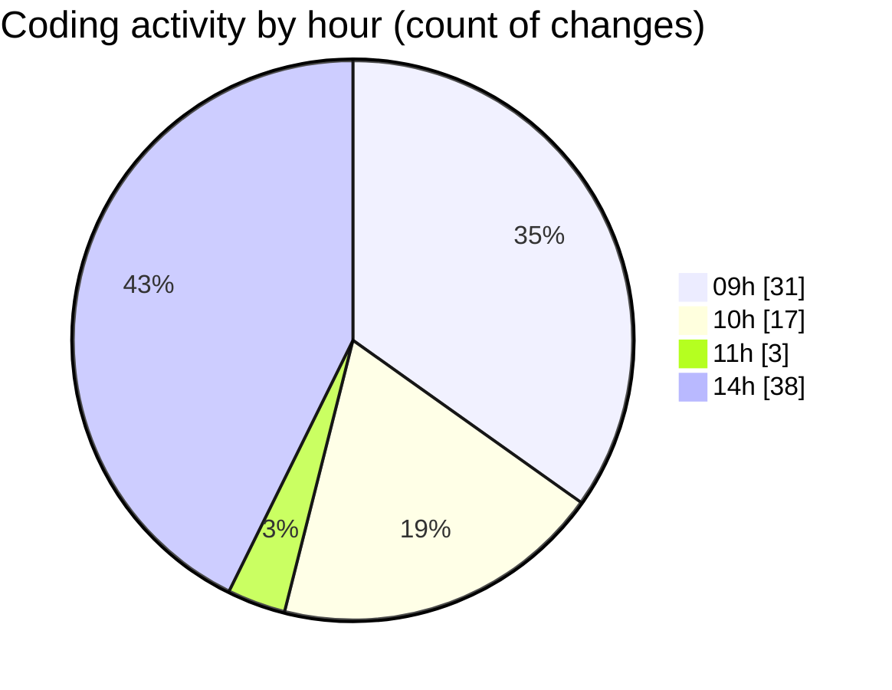

# termonied_testador - Activity Summary 

## Overall Statistics

| Stat                   | Value                                                             |
| ---------------------- | ----------------------------------------------------------------- |
| **Lines Added** (➕)   | 2609                                          |
| **Lines Removed** (➖) | 288                                        |
| **Net Change** (↕)    | 2321                |
| **Active Time** (⌚)   | 128 minutes |

## Modified Files
- **aeracao.go** (+272, -1)
- **EquipmentTester.tsx** (+622, -139)
- **GrokLayout.tsx** (+161, -0)
- **Mav.tsx** (+89, -2)
- **History.tsx** (+174, -0)
- **Motor.tsx** (+46, -3)
- **serial.go** (+621, -0)
- **vite.config.ts** (+14, -0)
- **termometria.go** (+300, -143)
- **app.go** (+69, -0)
- **queue.go** (+198, -0)
- **main.go** (+43, -0)

## Visualizations

### By File Type (Lines Changed)

### By Hour (Estimated Activity Count)

> **Last Updated:** 05/03/2025, 14:37:54