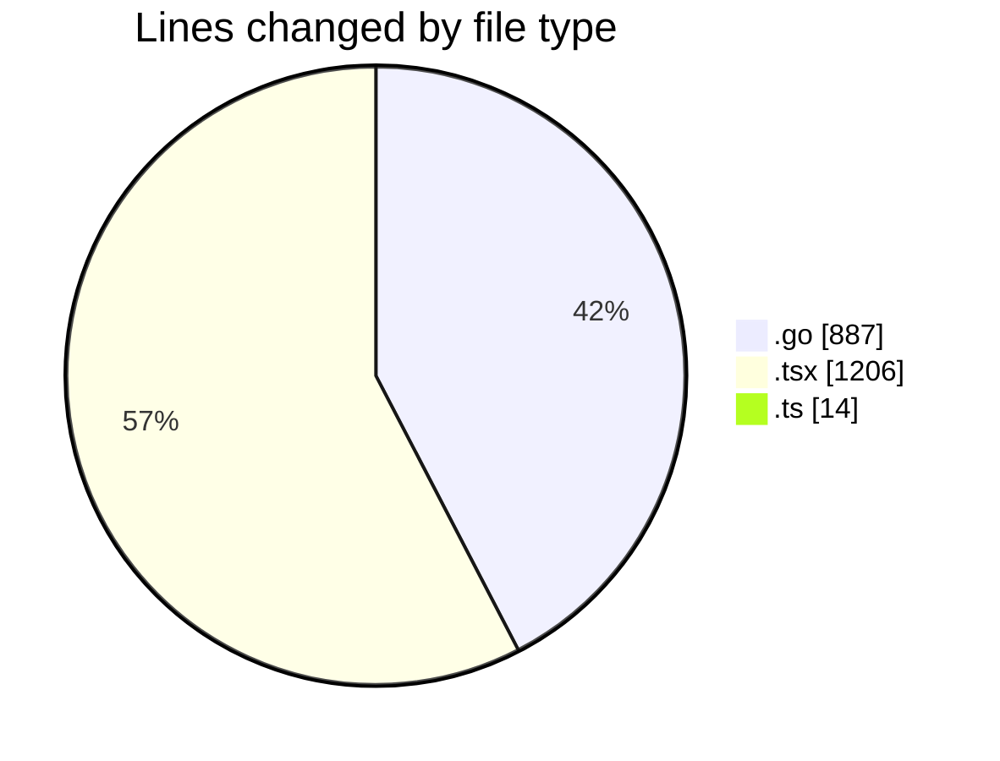
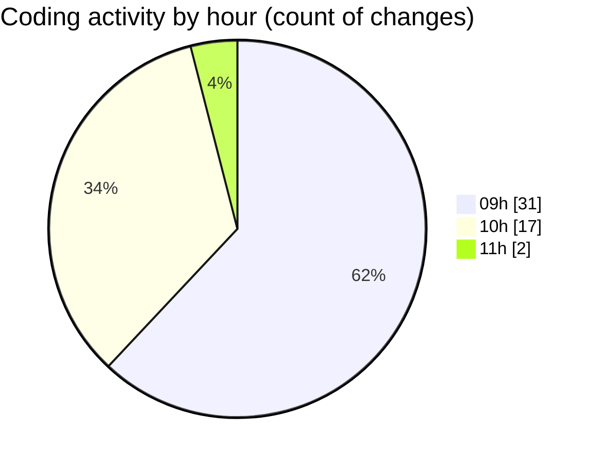

# termonied_testador - Activity Summary 

## Overall Statistics

| Stat                   | Value                                                             |
| ---------------------- | ----------------------------------------------------------------- |
| **Lines Added** (➕)   | 1978                                          |
| **Lines Removed** (➖) | 129                                        |
| **Net Change** (↕)    | 1849                |
| **Active Time** (⌚)   | 67 minutes |

## Modified Files
- **aeracao.go** (+272, -1)
- **EquipmentTester.tsx** (+608, -125)
- **GrokLayout.tsx** (+161, -0)
- **Mav.tsx** (+89, -0)
- **History.tsx** (+174, -0)
- **Motor.tsx** (+46, -3)
- **serial.go** (+614, -0)
- **vite.config.ts** (+14, -0)

## Visualizations

### By File Type (Lines Changed)

### By Hour (Estimated Activity Count)

> **Last Updated:** 05/03/2025, 11:10:14