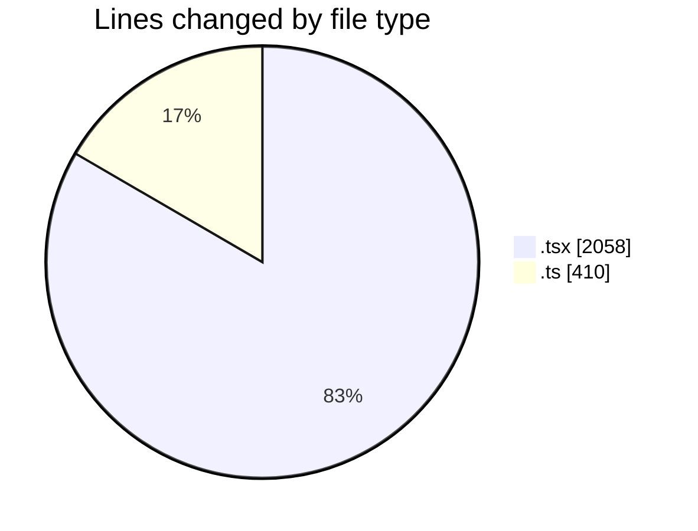
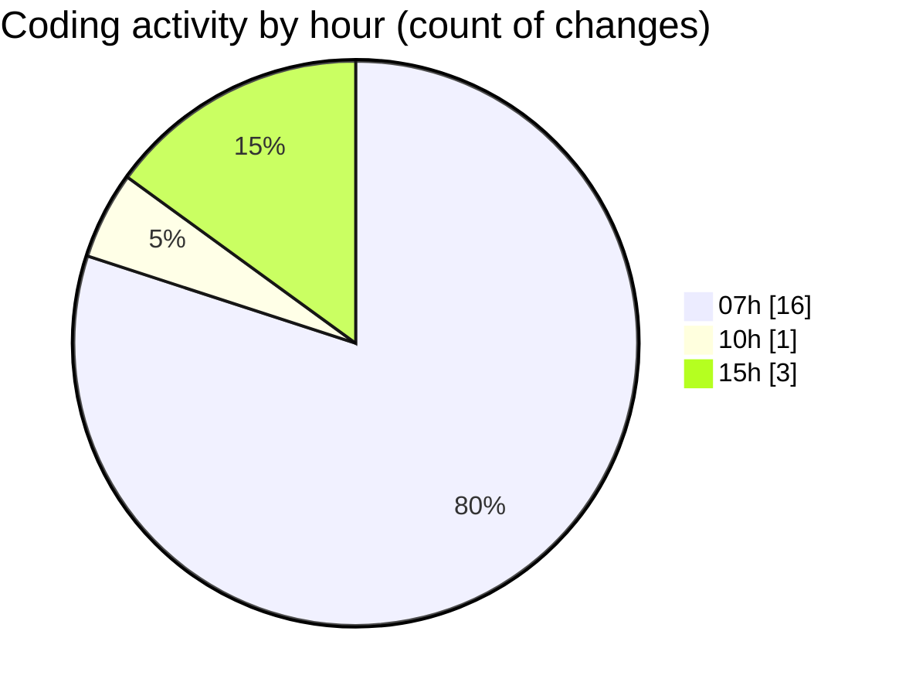

# mbc-web - Activity Summary 

## Overall Statistics

| Stat                   | Value                                                             |
| ---------------------- | ----------------------------------------------------------------- |
| **Lines Added** (➕)   | 2268                                          |
| **Lines Removed** (➖) | 200                                        |
| **Net Change** (↕)    | 2068                |
| **Active Time** (⌚)   | 25 minutes |

## Modified Files
- **AppSidebar.tsx** (+110, -0)
- **index.lazy.tsx** (+12, -0)
- **sidebar.tsx** (+762, -0)
- **NavMain.tsx** (+82, -0)
- **-config.tsx** (+867, -199)
- **-info-basicas.ts** (+221, -1)
- **-pagamento.tsx** (+26, -0)
- **types.ts** (+188, -0)

## Visualizations

### By File Type (Lines Changed)

### By Hour (Estimated Activity Count)

> **Last Updated:** 07/03/2025, 15:30:32