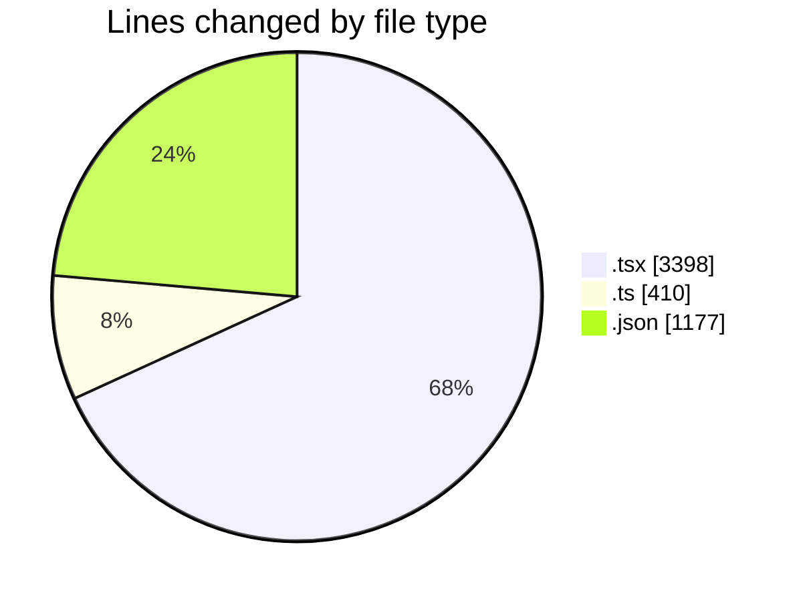
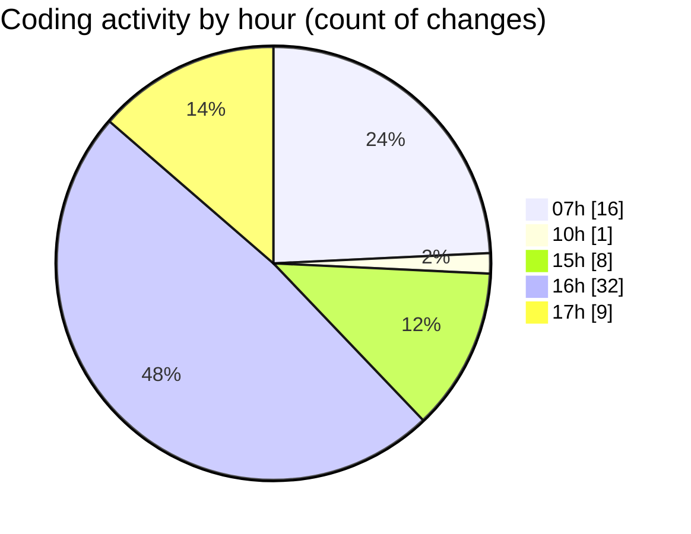

# mbc-web - Activity Summary 

## Overall Statistics

| Stat                   | Value                                                             |
| ---------------------- | ----------------------------------------------------------------- |
| **Lines Added** (➕)   | 4067                                          |
| **Lines Removed** (➖) | 918                                        |
| **Net Change** (↕)    | 3149                |
| **Active Time** (⌚)   | 86 minutes |

## Modified Files
- **AppSidebar.tsx** (+110, -0)
- **index.lazy.tsx** (+239, -17)
- **sidebar.tsx** (+762, -0)
- **NavMain.tsx** (+82, -0)
- **-config.tsx** (+932, -899)
- **-info-basicas.ts** (+221, -1)
- **-pagamento.tsx** (+28, -0)
- **types.ts** (+188, -0)
- **-itens.tsx** (+85, -0)
- **-status.tsx** (+46, -1)
- **-notas-fiscais.tsx** (+69, -0)
- **index.lazy.tsx** (+61, -0)
- **data.json** (+1146, -0)
- **settings.json** (+31, -0)
- **PaymentInfo.tsx** (+67, -0)

## Visualizations

### By File Type (Lines Changed)

### By Hour (Estimated Activity Count)

> **Last Updated:** 07/03/2025, 18:01:41