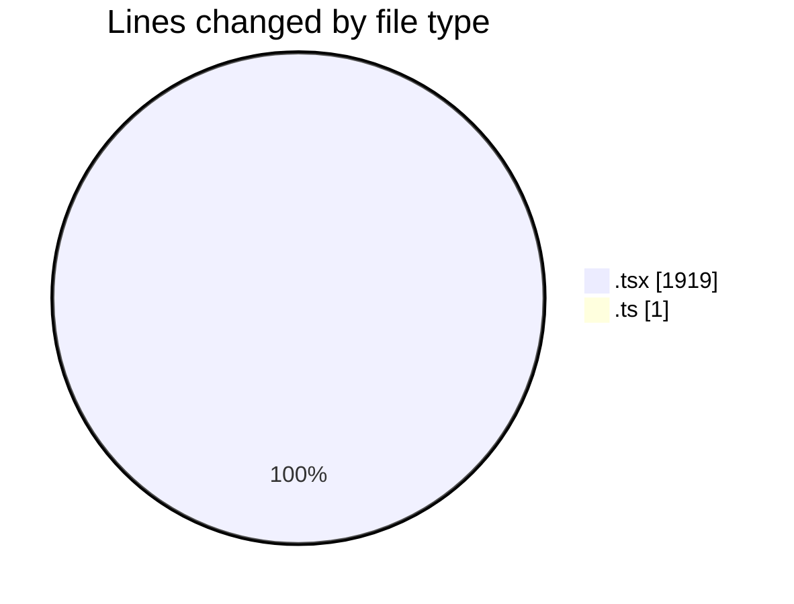
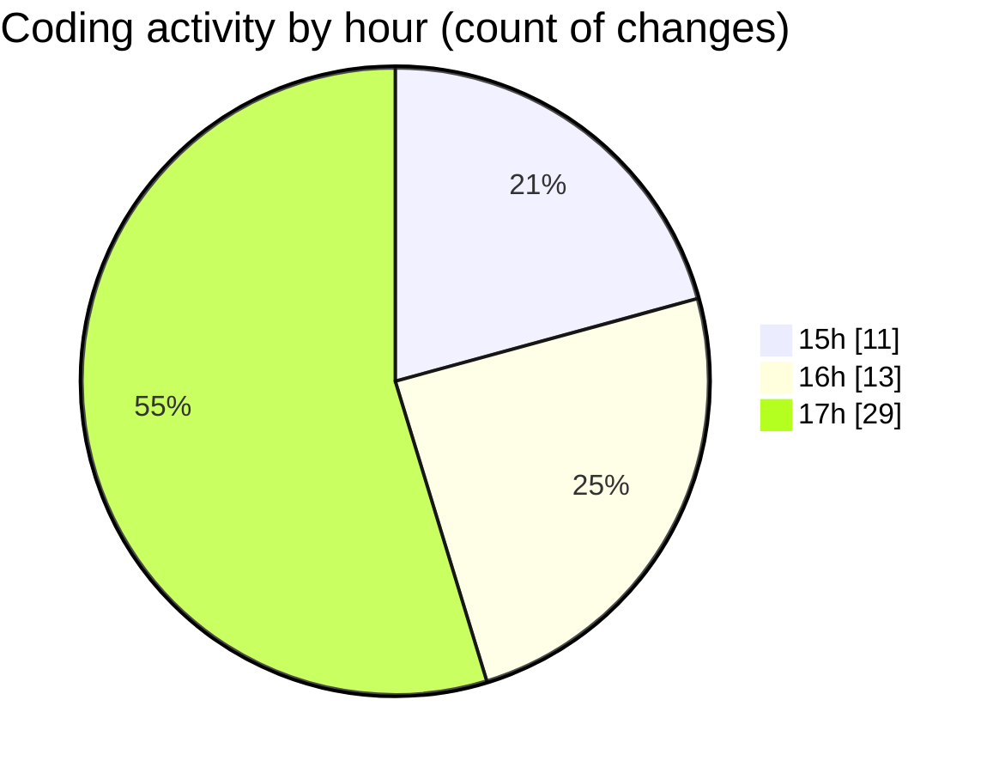

# mbc-web - Activity Summary 

## Overall Statistics

| Stat                   | Value                                                             |
| ---------------------- | ----------------------------------------------------------------- |
| **Lines Added** (➕)   | 1810                                          |
| **Lines Removed** (➖) | 110                                        |
| **Net Change** (↕)    | 1700                |
| **Active Time** (⌚)   | 79 minutes |

## Modified Files
- **RenderViewField.tsx** (+160, -1)
- **index.lazy.tsx** (+34, -8)
- **-pagamento.tsx** (+16, -0)
- **types.ts** (+1, -0)
- **RenderInputField.tsx** (+386, -1)
- **PaymentInfo.tsx** (+123, -43)
- **OrderTimeline.tsx** (+148, -53)
- **CrudRecordForm.tsx** (+478, -4)
- **index.tsx** (+464, -0)

## Visualizations

### By File Type (Lines Changed)

### By Hour (Estimated Activity Count)

> **Last Updated:** 08/03/2025, 17:48:07