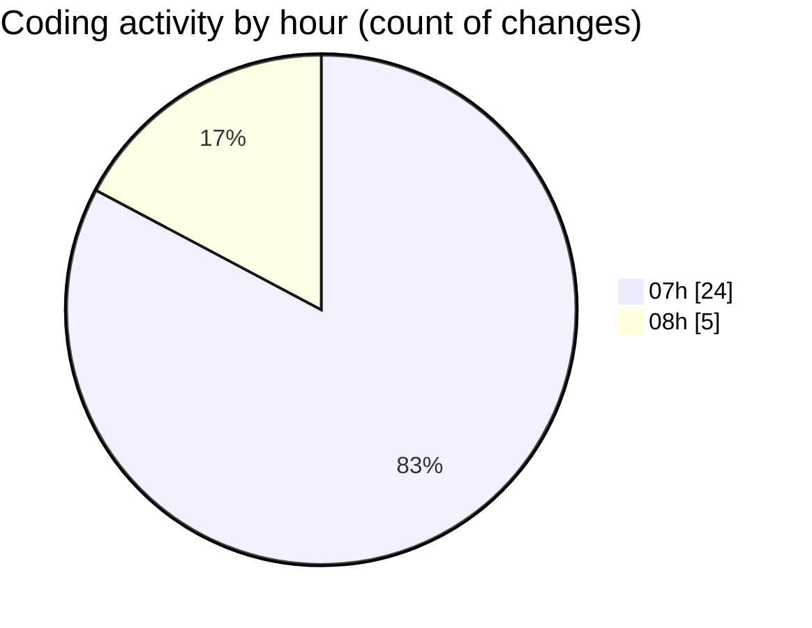

# mbc-web - Activity Summary 

## Overall Statistics

| Stat                   | Value                                                             |
| ---------------------- | ----------------------------------------------------------------- |
| **Lines Added** (➕)   | 162                                          |
| **Lines Removed** (➖) | 20                                        |
| **Net Change** (↕)    | 142                |
| **Active Time** (⌚)   | 44 minutes |

## Modified Files
- **index.lazy.tsx** (+19, -4)
- **OrderStatus.tsx** (+13, -3)
- **-notas-fiscais.tsx** (+1, -0)
- **RenderViewField.tsx** (+0, -1)
- **ActionMenu.tsx** (+42, -8)
- **CrudRecordForm.tsx** (+2, -0)
- **index.tsx** (+53, -1)
- **checkbox.tsx** (+32, -3)

## Visualizations

### By File Type (Lines Changed)

### By Hour (Estimated Activity Count)

> **Last Updated:** 10/03/2025, 08:11:57