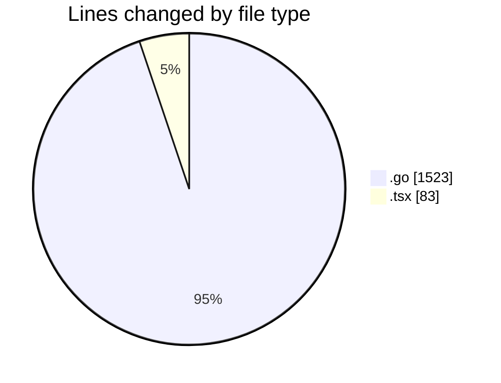
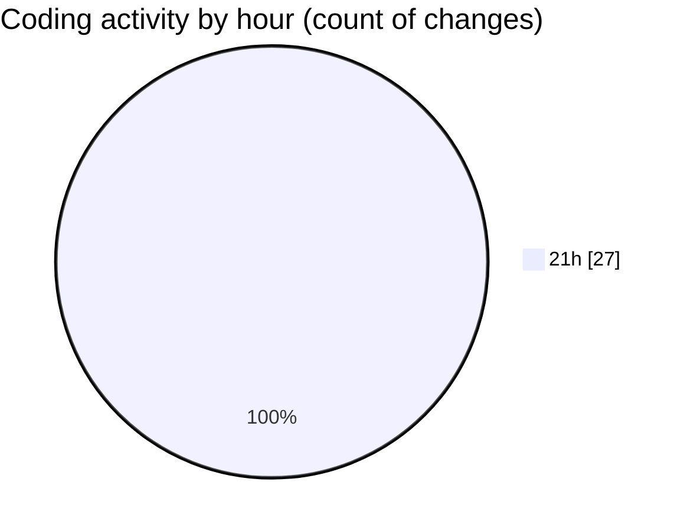

# termonied_testador - Activity Summary 

## Overall Statistics

| Stat                   | Value                                                             |
| ---------------------- | ----------------------------------------------------------------- |
| **Lines Added** (➕)   | 1606                                          |
| **Lines Removed** (➖) | 0                                        |
| **Net Change** (↕)    | 1606                |
| **Active Time** (⌚)   | 36 minutes |

## Modified Files
- **serial.go** (+873, -0)
- **termometria.go** (+188, -0)
- **estacao.go** (+175, -0)
- **Station.tsx** (+83, -0)
- **aeracao.go** (+287, -0)

## Visualizations

### By File Type (Lines Changed)

### By Hour (Estimated Activity Count)

> **Last Updated:** 10/03/2025, 21:51:32