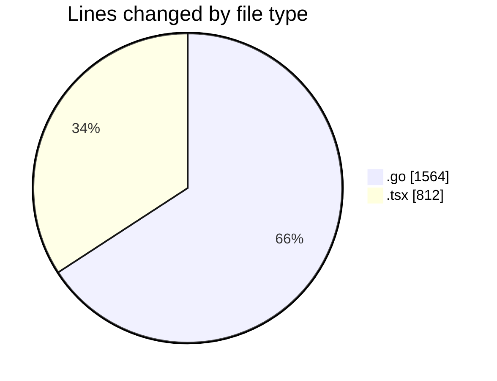
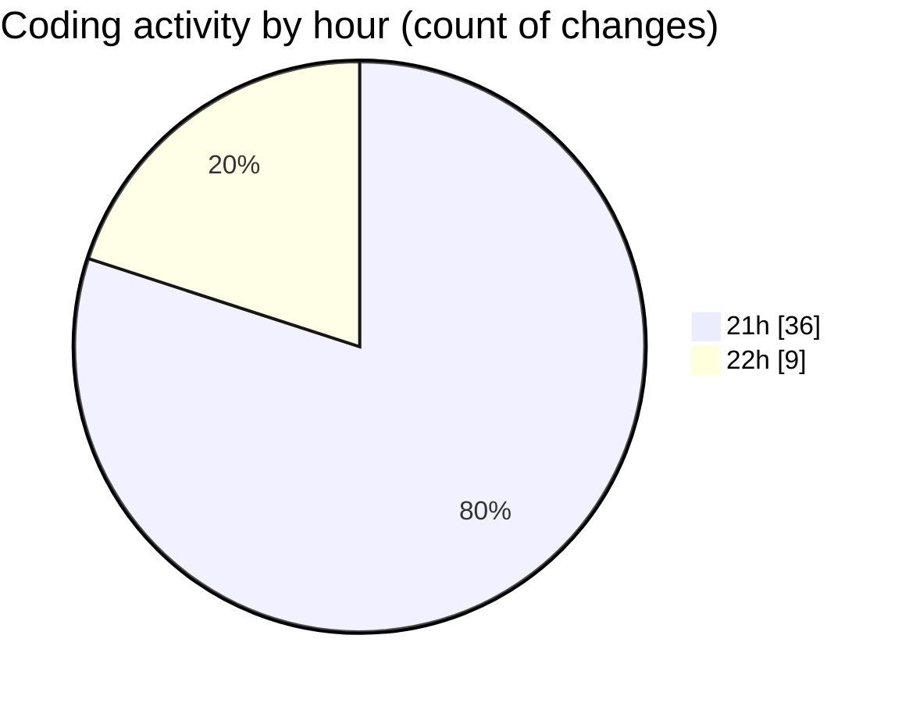

# termonied_testador - Activity Summary 

## Overall Statistics

| Stat                   | Value                                                             |
| ---------------------- | ----------------------------------------------------------------- |
| **Lines Added** (➕)   | 2373                                          |
| **Lines Removed** (➖) | 3                                        |
| **Net Change** (↕)    | 2370                |
| **Active Time** (⌚)   | 64 minutes |

## Modified Files
- **serial.go** (+873, -0)
- **termometria.go** (+188, -0)
- **estacao.go** (+175, -0)
- **Station.tsx** (+83, -0)
- **aeracao.go** (+325, -3)
- **Aeracao.tsx** (+95, -0)
- **Mav.tsx** (+93, -0)
- **EquipmentTester.tsx** (+541, -0)

## Visualizations

### By File Type (Lines Changed)

### By Hour (Estimated Activity Count)

> **Last Updated:** 10/03/2025, 22:16:32