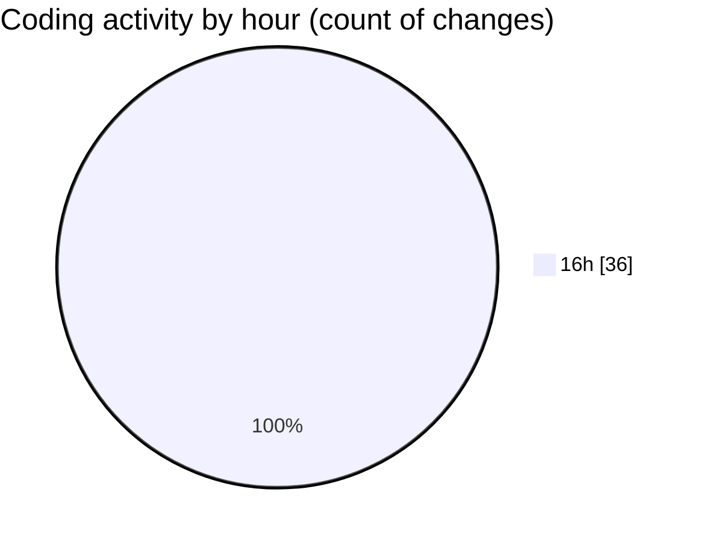

# mbc-web - Activity Summary 

## Overall Statistics

| Stat                   | Value                                                             |
| ---------------------- | ----------------------------------------------------------------- |
| **Lines Added** (➕)   | 1074                                          |
| **Lines Removed** (➖) | 12                                        |
| **Net Change** (↕)    | 1062                |
| **Active Time** (⌚)   | 53 minutes |

## Modified Files
- **-config.tsx** (+867, -0)
- **index.tsx** (+14, -0)
- **index.lazy.tsx** (+30, -0)
- **CriarRemessaModal.tsx** (+80, -10)
- **AddRemessaModal.tsx** (+83, -2)

## Visualizations

### By File Type (Lines Changed)

### By Hour (Estimated Activity Count)

> **Last Updated:** 11/03/2025, 16:50:31