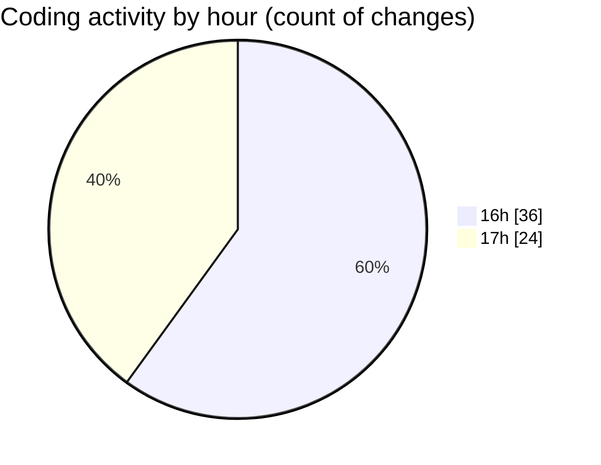

# mbc-web - Activity Summary 

## Overall Statistics

| Stat                   | Value                                                             |
| ---------------------- | ----------------------------------------------------------------- |
| **Lines Added** (➕)   | 1394                                          |
| **Lines Removed** (➖) | 30                                        |
| **Net Change** (↕)    | 1364                |
| **Active Time** (⌚)   | 82 minutes |

## Modified Files
- **-config.tsx** (+867, -0)
- **index.tsx** (+14, -0)
- **index.lazy.tsx** (+31, -0)
- **CriarRemessaModal.tsx** (+80, -10)
- **AddRemessaModal.tsx** (+83, -3)
- **AppSidebar.tsx** (+0, -1)
- **OrderTimeline.tsx** (+102, -4)
- **ActionMenu.tsx** (+34, -7)
- **-config.tsx** (+33, -0)
- **-config.tsx** (+33, -0)
- **index.lazy.tsx** (+1, -0)
- **index.lazy.tsx** (+34, -0)
- **CodigoRastreioModal.tsx** (+82, -5)

## Visualizations

### By File Type (Lines Changed)

### By Hour (Estimated Activity Count)

> **Last Updated:** 11/03/2025, 17:45:31