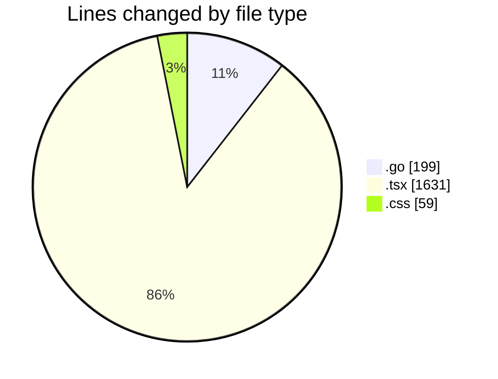
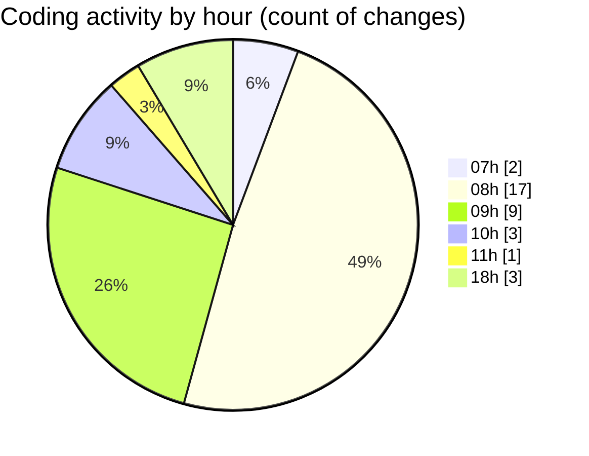

# termonied_testador - Activity Summary 

## Overall Statistics

| Stat                   | Value                                                             |
| ---------------------- | ----------------------------------------------------------------- |
| **Lines Added** (➕)   | 1587                                          |
| **Lines Removed** (➖) | 302                                        |
| **Net Change** (↕)    | 1285                |
| **Active Time** (⌚)   | 49 minutes |

## Modified Files
- **aeracao.go** (+110, -0)
- **EquipmentTester.tsx** (+58, -0)
- **termometria.go** (+15, -0)
- **app.go** (+74, -0)
- **App.tsx** (+448, -299)
- **main.tsx** (+18, -3)
- **EquipmentTester.tsx** (+1, -0)
- **App.css** (+59, -0)
- **TesteRapido.tsx** (+804, -0)

## Visualizations

### By File Type (Lines Changed)

### By Hour (Estimated Activity Count)

> **Last Updated:** 11/03/2025, 18:30:46