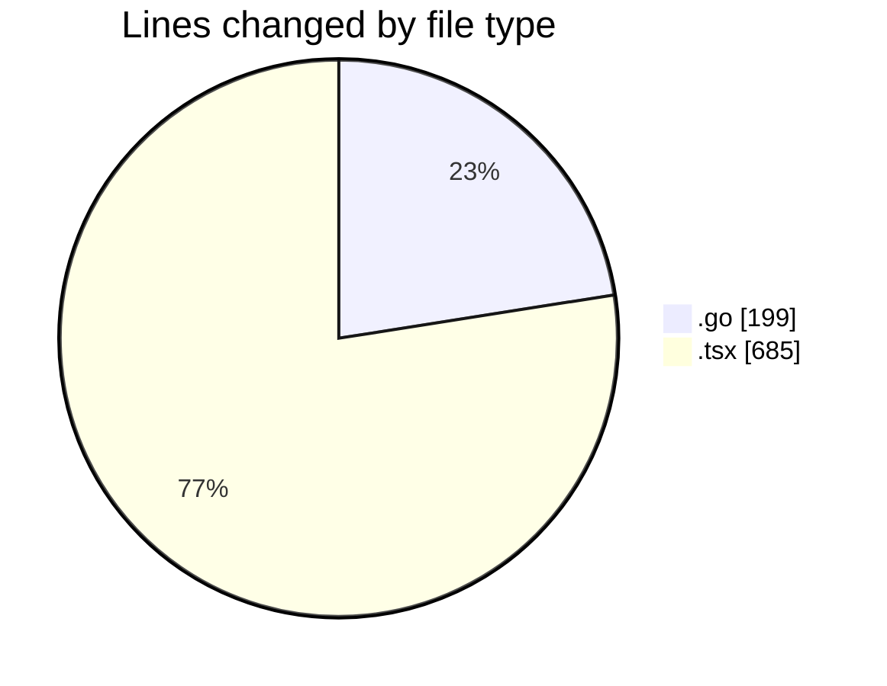
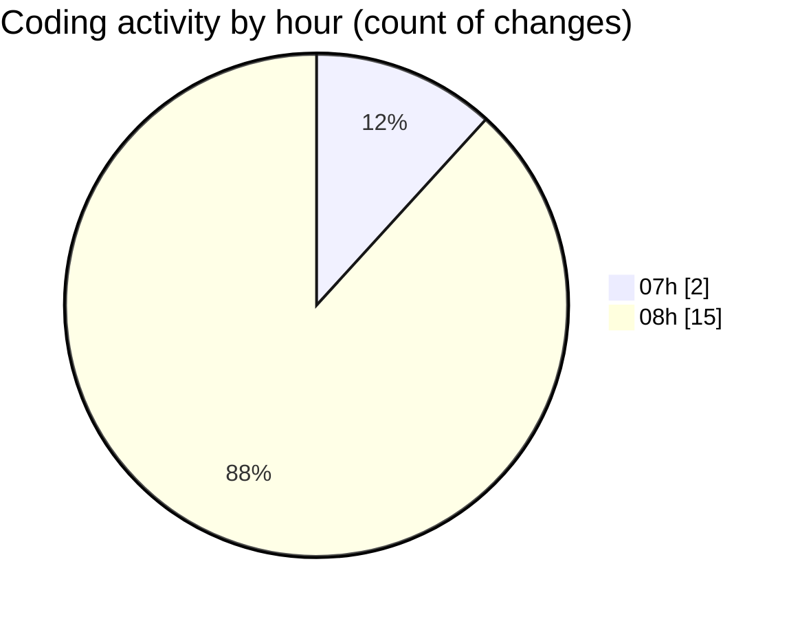

# termonied_testador - Activity Summary 

## Overall Statistics

| Stat                   | Value                                                             |
| ---------------------- | ----------------------------------------------------------------- |
| **Lines Added** (➕)   | 585                                          |
| **Lines Removed** (➖) | 299                                        |
| **Net Change** (↕)    | 286                |
| **Active Time** (⌚)   | 24 minutes |

## Modified Files
- **aeracao.go** (+110, -0)
- **EquipmentTester.tsx** (+58, -0)
- **termometria.go** (+15, -0)
- **app.go** (+74, -0)
- **App.tsx** (+309, -299)
- **main.tsx** (+18, -0)
- **EquipmentTester.tsx** (+1, -0)

## Visualizations

### By File Type (Lines Changed)

### By Hour (Estimated Activity Count)

> **Last Updated:** 11/03/2025, 08:36:20