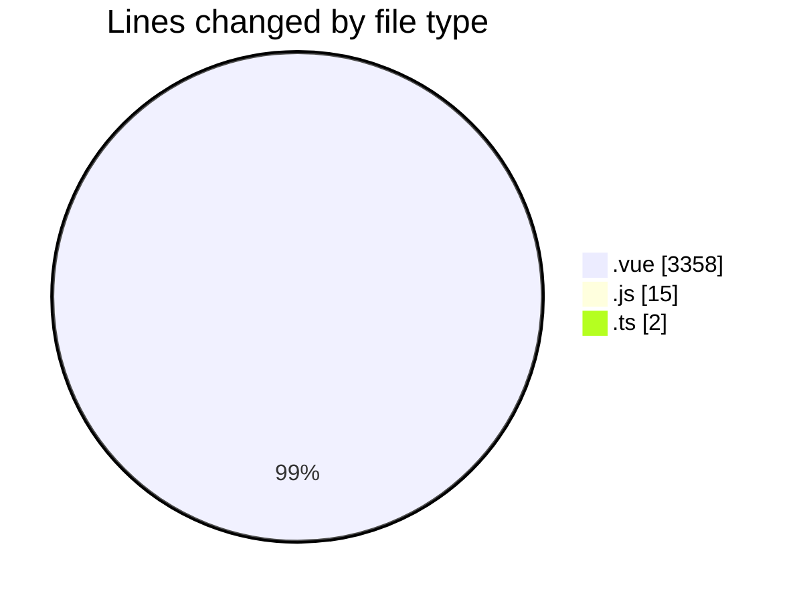
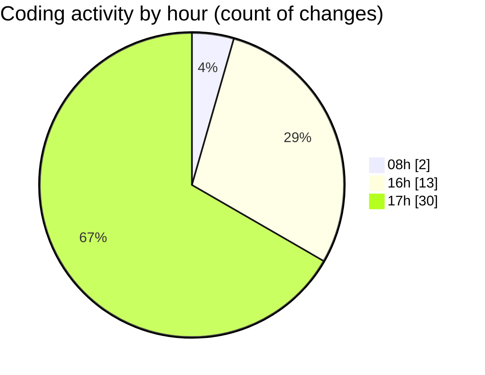

# lumine-web - Activity Summary 

## Overall Statistics

| Stat                   | Value                                                             |
| ---------------------- | ----------------------------------------------------------------- |
| **Lines Added** (➕)   | 3230                                          |
| **Lines Removed** (➖) | 145                                        |
| **Net Change** (↕)    | 3085                |
| **Active Time** (⌚)   | 67 minutes |

## Modified Files
- **CardContent.vue** (+65, -18)
- **CarouselContent.vue** (+287, -0)
- **BannerDetailContent.vue** (+257, -18)
- **CardContent.vue** (+206, -0)
- **CarouselContent.vue** (+1005, -47)
- **Page.vue** (+191, -0)
- **Tags.vue** (+150, -17)
- **Search.vue** (+322, -0)
- **MyArea.vue** (+168, -15)
- **List.vue** (+147, -14)
- **Catalog.vue** (+163, -12)
- **ImmersionCarousel.vue** (+252, -4)
- **teste.js** (+15, -0)
- **customEvents.ts** (+2, -0)

## Visualizations

### By File Type (Lines Changed)

### By Hour (Estimated Activity Count)

> **Last Updated:** 14/03/2025, 17:42:54