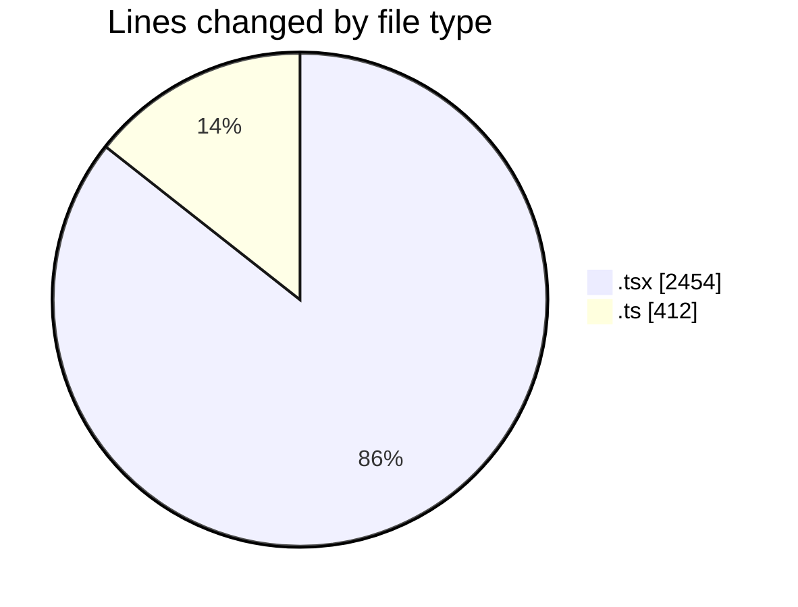
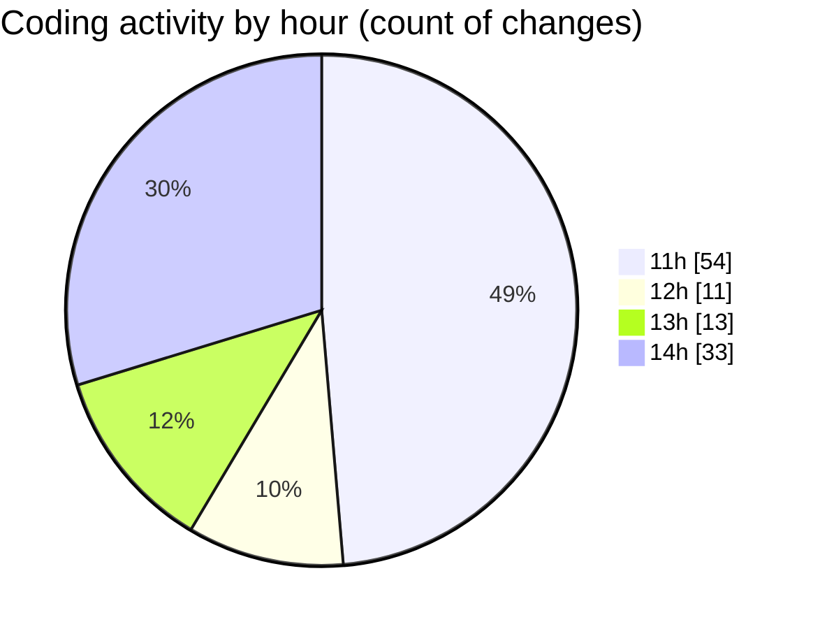

# audiobooks-web - Activity Summary 

## Overall Statistics

| Stat                   | Value                                                             |
| ---------------------- | ----------------------------------------------------------------- |
| **Lines Added** (➕)   | 2736                                          |
| **Lines Removed** (➖) | 130                                        |
| **Net Change** (↕)    | 2606                |
| **Active Time** (⌚)   | 125 minutes |

## Modified Files
- **ContentBlockedPopup.tsx** (+52, -16)
- **refreshTokenService.ts** (+71, -7)
- **axiosConfig.ts** (+179, -59)
- **MainContent.tsx** (+54, -7)
- **AudioList.tsx** (+296, -25)
- **contents.ts** (+51, -2)
- **journey.ts** (+42, -1)
- **PlayerContext.tsx** (+236, -10)
- **index.tsx** (+155, -1)
- **CollectionsTab.tsx** (+259, -0)
- **$jornada.tsx** (+202, -0)
- **$livro.tsx** (+235, -0)
- **index.tsx** (+763, -0)
- **index.tsx** (+141, -2)

## Visualizations

### By File Type (Lines Changed)

### By Hour (Estimated Activity Count)

> **Last Updated:** 17/03/2025, 14:37:17