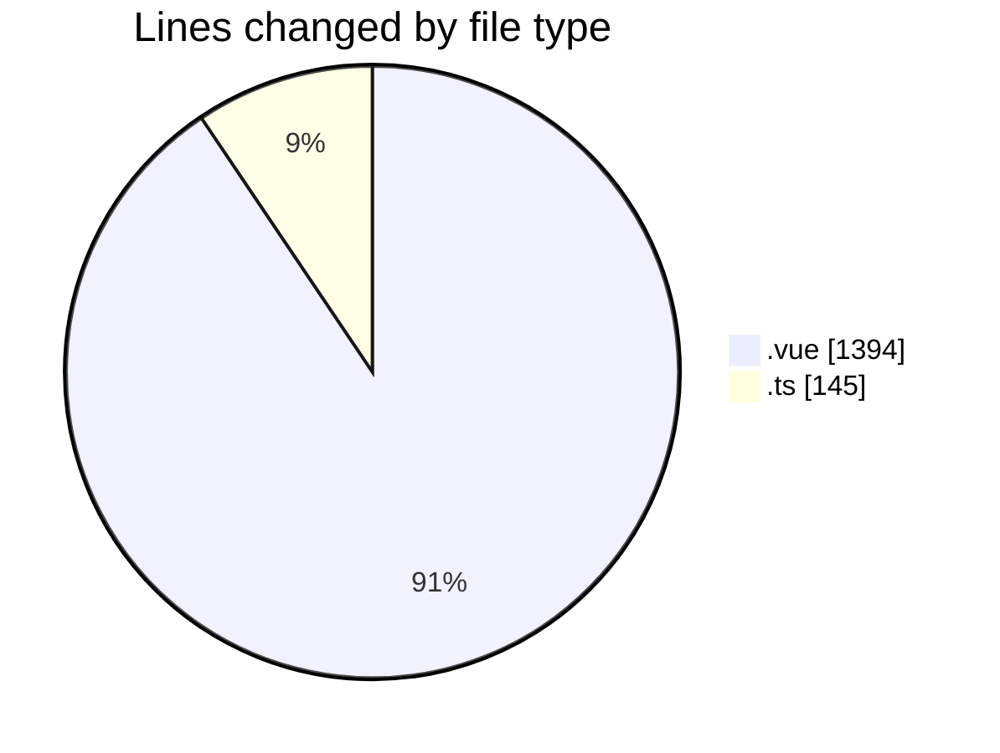
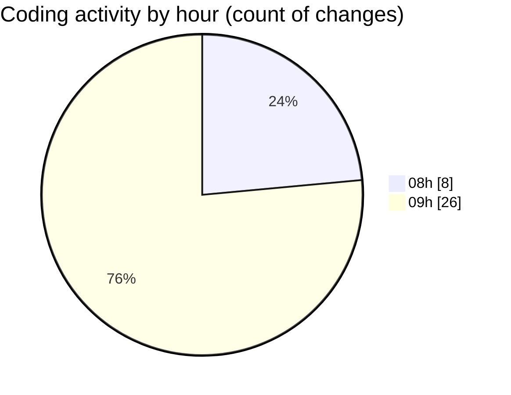

# lumine-web - Activity Summary 

## Overall Statistics

| Stat                   | Value                                                             |
| ---------------------- | ----------------------------------------------------------------- |
| **Lines Added** (➕)   | 1383                                          |
| **Lines Removed** (➖) | 156                                        |
| **Net Change** (↕)    | 1227                |
| **Active Time** (⌚)   | 47 minutes |

## Modified Files
- **Banner.vue** (+101, -0)
- **CarouselBanner.vue** (+111, -0)
- **Page.vue** (+67, -0)
- **ListButton.vue** (+116, -5)
- **customEvents.ts** (+3, -98)
- **DetailContent.vue** (+662, -53)
- **TopBar.vue** (+80, -0)
- **types.ts** (+44, -0)
- **Page.vue** (+65, -0)
- **Page.vue** (+67, -0)
- **Page.vue** (+67, -0)

## Visualizations

### By File Type (Lines Changed)

### By Hour (Estimated Activity Count)

> **Last Updated:** 17/03/2025, 09:23:41