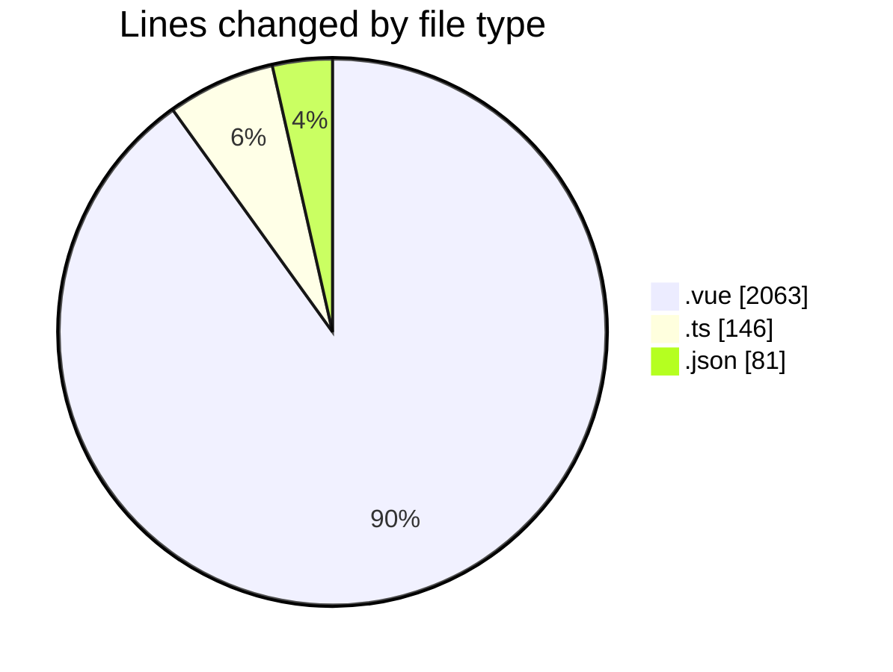
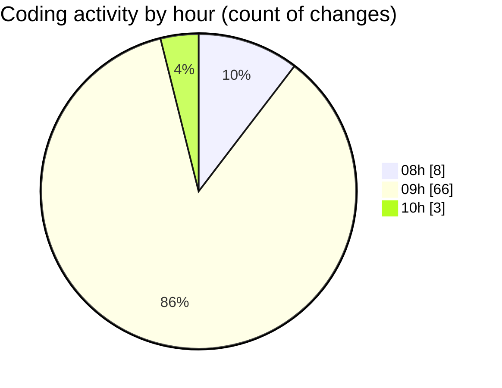

# lumine-web - Activity Summary 

## Overall Statistics

| Stat                   | Value                                                             |
| ---------------------- | ----------------------------------------------------------------- |
| **Lines Added** (➕)   | 1799                                          |
| **Lines Removed** (➖) | 491                                        |
| **Net Change** (↕)    | 1308                |
| **Active Time** (⌚)   | 89 minutes |

## Modified Files
- **Banner.vue** (+123, -22)
- **CarouselBanner.vue** (+113, -2)
- **Page.vue** (+67, -0)
- **ListButton.vue** (+127, -16)
- **customEvents.ts** (+3, -99)
- **DetailContent.vue** (+715, -106)
- **TopBar.vue** (+109, -30)
- **types.ts** (+44, -0)
- **Page.vue** (+65, -0)
- **Page.vue** (+67, -0)
- **Page.vue** (+67, -0)
- **App.vue** (+20, -20)
- **ImmersionCarousel.vue** (+4, -4)
- **CardContent.vue** (+7, -6)
- **CarouselContent.vue** (+15, -12)
- **WatchButton.vue** (+17, -17)
- **CarouselContent.vue** (+43, -43)
- **BannerDetailContent.vue** (+6, -6)
- **CardContent.vue** (+48, -48)
- **MyArea.vue** (+15, -15)
- **Page.vue** (+1, -1)
- **Catalog.vue** (+12, -12)
- **Tags.vue** (+17, -17)
- **List.vue** (+14, -14)
- **package.json** (+80, -1)

## Visualizations

### By File Type (Lines Changed)

### By Hour (Estimated Activity Count)

> **Last Updated:** 17/03/2025, 10:13:41