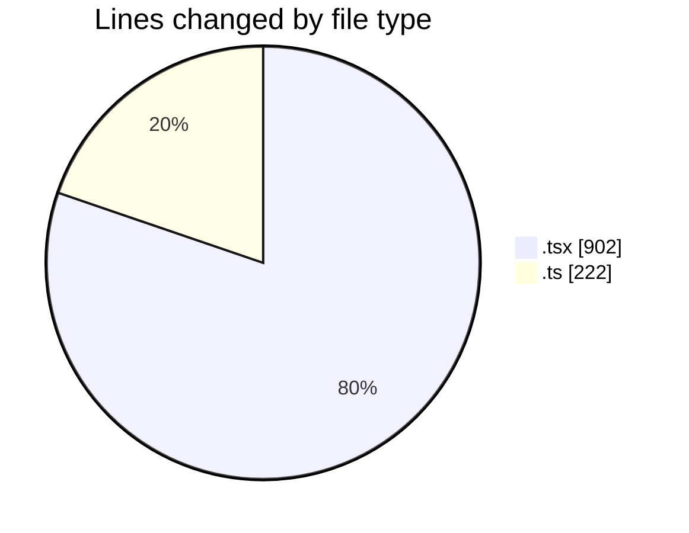
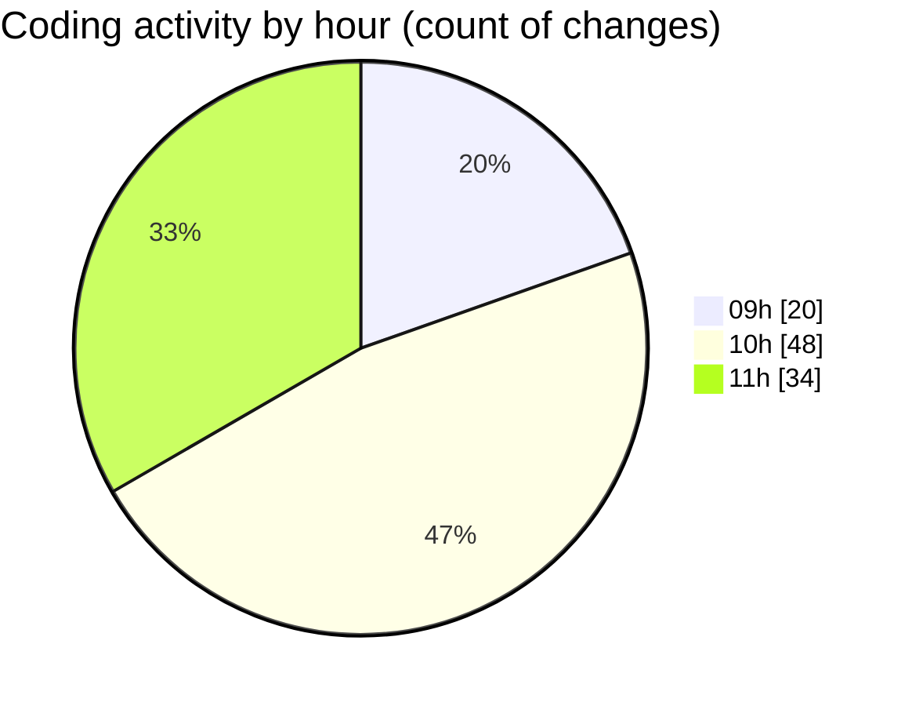

# peregrino-web - Activity Summary 

## Overall Statistics

| Stat                   | Value                                                             |
| ---------------------- | ----------------------------------------------------------------- |
| **Lines Added** (➕)   | 1033                                          |
| **Lines Removed** (➖) | 91                                        |
| **Net Change** (↕)    | 942                |
| **Active Time** (⌚)   | 132 minutes |

## Modified Files
- **page.tsx** (+1, -2)
- **page.tsx** (+109, -0)
- **auth.ts** (+25, -0)
- **input.tsx** (+31, -19)
- **layout.tsx** (+4, -4)
- **page.tsx** (+69, -0)
- **page.tsx** (+85, -8)
- **layout.tsx** (+25, -8)
- **Sidebar.tsx** (+78, -2)
- **SidebarMenuItem.tsx** (+44, -0)
- **page.tsx** (+11, -0)
- **Header.tsx** (+121, -10)
- **user.ts** (+21, -0)
- **useAuth.ts** (+39, -0)
- **Footer.tsx** (+83, -1)
- **CarouselBooks.tsx** (+182, -5)
- **slug.ts** (+12, -0)
- **homeService.ts** (+93, -32)

## Visualizations

### By File Type (Lines Changed)

### By Hour (Estimated Activity Count)

> **Last Updated:** 19/03/2025, 11:23:54