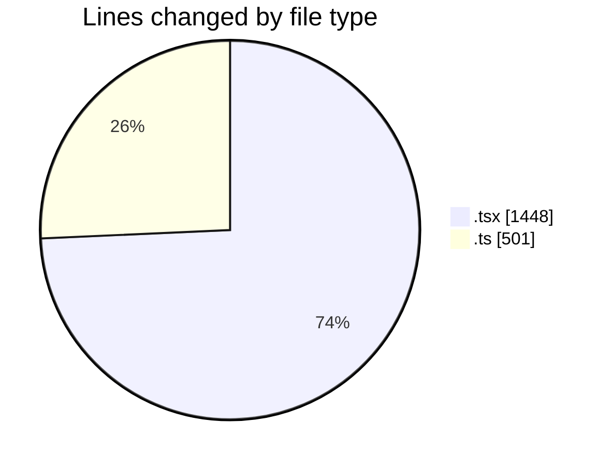
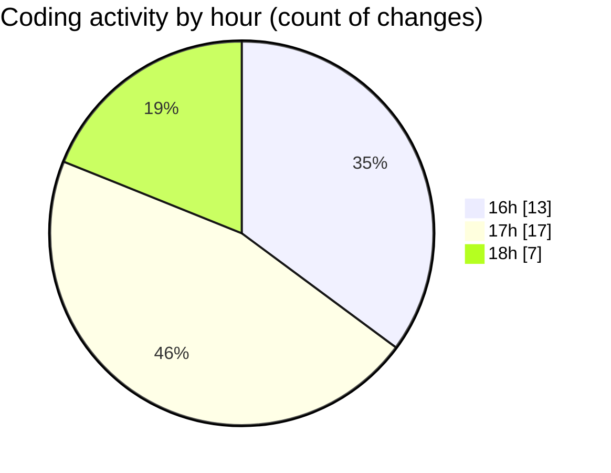

# mbc-web - Activity Summary 

## Overall Statistics

| Stat                   | Value                                                             |
| ---------------------- | ----------------------------------------------------------------- |
| **Lines Added** (➕)   | 1890                                          |
| **Lines Removed** (➖) | 59                                        |
| **Net Change** (↕)    | 1831                |
| **Active Time** (⌚)   | 41 minutes |

## Modified Files
- **CrudFilter.tsx** (+537, -9)
- **useSearchParams.ts** (+238, -12)
- **index.lazy.tsx** (+151, -20)
- **useClientes.ts** (+51, -7)
- **__root.tsx** (+44, -1)
- **ClientesAPI.ts** (+37, -3)
- **AbstractApiClient.ts** (+149, -4)
- **index.tsx** (+683, -3)

## Visualizations

### By File Type (Lines Changed)

### By Hour (Estimated Activity Count)

> **Last Updated:** 20/05/2025, 18:19:31