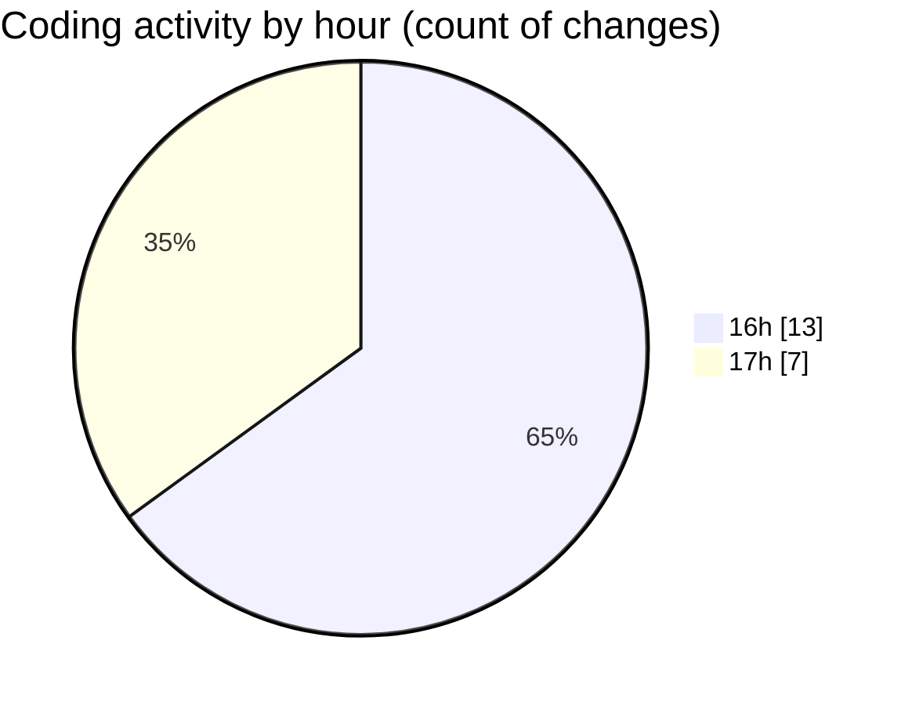

# mbc-web - Activity Summary 

## Overall Statistics

| Stat                   | Value                                                             |
| ---------------------- | ----------------------------------------------------------------- |
| **Lines Added** (➕)   | 985                                          |
| **Lines Removed** (➖) | 27                                        |
| **Net Change** (↕)    | 958                |
| **Active Time** (⌚)   | 14 minutes |

## Modified Files
- **CrudFilter.tsx** (+537, -9)
- **useSearchParams.ts** (+238, -12)
- **index.lazy.tsx** (+141, -5)
- **useClientes.ts** (+25, -0)
- **__root.tsx** (+44, -1)

## Visualizations

### By File Type (Lines Changed)

### By Hour (Estimated Activity Count)

> **Last Updated:** 20/05/2025, 17:39:31